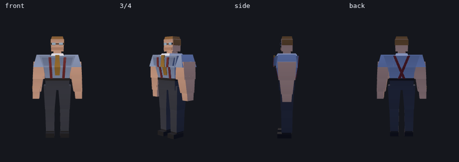
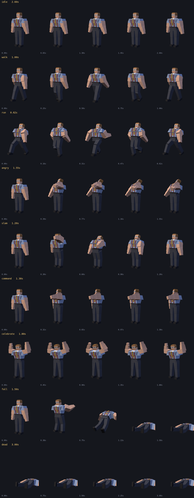

# Bad Office Manager — 3D model



`bad_office_manager.glb` is the player character from `docs/3d-game-spec.md`:
a rigged, textured, animated glTF 2.0 binary carrying all nine manager
animation roles. It is source art for the 3D build. **The shipped 2D game does
not load it** — `scripts/build-site.sh` deletes `assets/models` from the deploy
bundle on purpose.

> `docs/3d-game-spec.md` is not on this branch yet — it lives on
> `claude/inspiring-dijkstra-lobgy8`. Every section reference below (§4.3, §9.1,
> §9.3 …) points at that document, and the paths resolve once it lands on `main`.

| | |
|---|---|
| Format | glTF 2.0 binary (`.glb`), self-contained |
| Size | 112 KB |
| Geometry | 1152 vertices, 576 triangles, one mesh, one material |
| Texture | 128×128 palette atlas, embedded, nearest-filtered |
| Rig | 20 joints, rigid skinning (one joint per vertex) |
| Animations | 9 clips, 14.5 s total |
| Axes | Y up, faces −Z, +X is his left, feet on y=0, metres |

## Spec compliance

`gen_manager_glb.py` asserts these on every run and fails if they drift:

| Spec | Required | Actual |
|---|---|---|
| §4.3 height | 1.85 m | 1.850 m |
| §4.3 collision capsule | fits within ⌀1.10 m | 0.920 m widest |
| — | feet on the floor | y = 0.000 |
| §9.3 red accent | present | maroon suspenders |
| §9.3 roles | 9 manager roles | all 9 present |

Proportions follow `docs/concept/bad-office-manager-concept-sheet.webp`: crew
cut, glasses, blue short-sleeve shirt, X-back maroon suspenders, gold tie, dark
slacks, watch on the left wrist. The concept sheet's 32×48 pixel grid does not
apply here — that is a 2D sprite constraint.

The spec's "must look *heavy*" (§9.3) is carried by the chest taper (0.43 m
waist → 0.64 m chest), the traps, and deltoids that run out past the chest. Bulk
in the silhouette, not in the polygon count.

## Animations



| Clip | Length | Loop | Used for |
|---|---|---|---|
| `idle` | 2.60 s | yes | Standing still |
| `walk` | 1.00 s | yes | Normal movement |
| `run` | 0.62 s | yes | Sustained movement |
| `angry` | 1.55 s | no | Dumping the coffee pot |
| `slam` | 1.20 s | no | Closing the bathroom |
| `command` | 1.30 s | no | Ordering someone back to their desk |
| `celebrate` | 1.80 s | yes | Win ending |
| `fall` | 1.50 s | no | Lose-on-target ending |
| `dead` | 3.00 s | yes | Breakdown ending |

Every one-shot ends with a 0.25 s hold on its final pose, per §9.3, so the
reaction still reads if locomotion resumes immediately. `fall` ends exactly on
`dead`'s first frame, so the two chain without a pop.

Clips carry no root motion — the manager is moved by code, not by the
animation. The only translation authored is a vertical bob on `walk`/`run` and
the drop in `fall`/`dead`.

## Rig

```
root                         on the floor between the feet
└─ hips
   ├─ spine ─ chest
   │  ├─ neck ─ head
   │  ├─ clav_L ─ upperarm_L ─ forearm_L ─ hand_L
   │  └─ clav_R ─ upperarm_R ─ forearm_R ─ hand_R
   ├─ thigh_L ─ shin_L ─ foot_L
   └─ thigh_R ─ shin_R ─ foot_R
```

Bind pose is identity rotation on every joint, so each inverse bind matrix is a
pure inverse translation and the rest pose is the modelled pose.

Joint names avoid `.` deliberately: three.js rewrites dots in node names (`clav.L`
silently becomes `clavL`), which breaks anything that retargets by name.

Rotation sign convention, which is easy to get backwards: **positive X on an arm
or leg joint swings it forward**, toward −Z, the way he faces. Positive Z raises
an arm out to the side.

## Regenerating

```sh
python3 gen_manager_glb.py
```

No dependencies — the mesh, the palette PNG, the skin weights, the animation
curves and the GLB container are all written by hand from `struct`/`zlib`. The
`.glb` is generated output and is committed, the same way the 2D sprite frames
are. Edit the script, never the binary.

## Previewing

`preview/` holds the renders above and the harness that produced them. The
harness is optional dev tooling and needs npm, which nothing else in this repo
does:

```sh
cd preview
npm install three playwright
node render.js
```

It serves the `.glb` to headless Chromium, loads it with three.js `GLTFLoader`,
prints what the loader actually found in the file, and writes
`turnaround.png`, `closeup.png` and `animations.png`.

Run it after any change to the generator. The generator's own assertions only
check its arithmetic — they cannot tell you the container parses, the skin
binds, or that an arm swings the way you intended. Every real bug in this model
so far was invisible in the numbers and obvious in the render.

## Known limitations

- **Rigid skinning.** One joint per vertex, no blending. Parts overlap 3–5 cm at
  every joint so rotation does not open a seam, but a hard bend still creases
  visibly. Fine at isometric distance; a smooth-skinned replacement would be the
  first upgrade if §9.1's first-person requirement proves demanding.
- **The face is minimal** — brow, glasses, a mouth line. It reads at isometric
  and conversation distance but will not carry a close-up.
- **No `work`/`talk`/`wait`/`carry`/`sit`.** Those are employee roles in §9.3;
  this is the manager.
- **No props.** The coffee pot `angry` mimes and the door `slam` hits are the
  environment's, per §9.4. The mug from the concept sheet is deliberately
  absent: `carry` is not a manager role, and a permanently held mug would be
  wrong in eight of the nine clips.
- **Employees do not exist yet.** §9.3 asks for 3–5 visually distinct variants;
  this generator is written for one character and would need a variant system
  to serve them.
