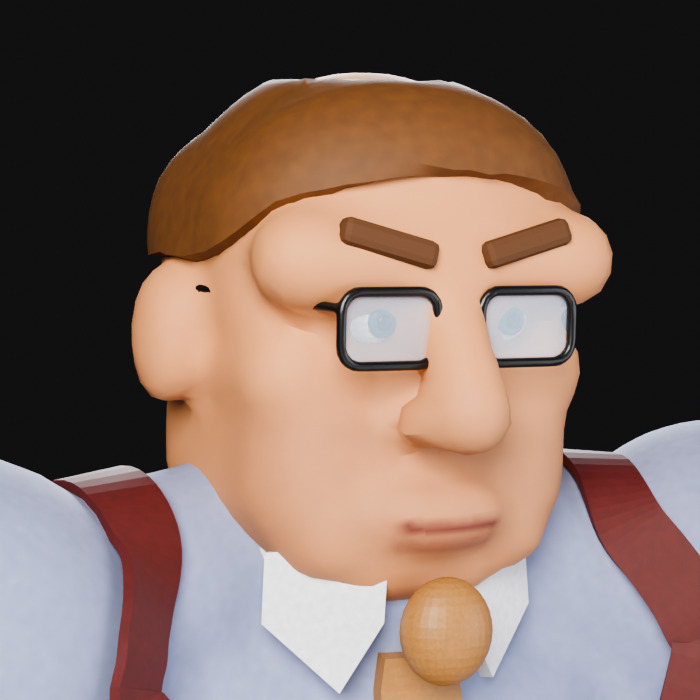

# Bad Office Manager — 3D model


`bad_office_manager.glb` is the player character from `docs/3d-game-spec.md`,
built in Blender: a smooth, textured, rigged and animated glTF 2.0 binary with
the full animation set from the concept sheet. It is source art for the 3D
build. **The shipped 2D game does not load it** — `scripts/build-site.sh`
deletes `assets/models` from the deploy bundle on purpose.

| | |
|---|---|
| Format | glTF 2.0 binary (`.glb`), self-contained |
| Geometry | `Manager` ~68k triangles (one skinned mesh, one material), `Lenses` (alpha-blended), `Mug` (rigid prop on the right hand) |
| Textures | 2048² baked base-colour + roughness atlas, 1024×512 mug label, all PNG, embedded |
| Rig | 23 joints, up to 4 influences per vertex, smooth (bone-heat) skinning |
| Animations | 15 clips (below) |
| Axes | Y up, **faces +Z** (glTF / three.js convention), +X is his left, feet on y = 0, metres |
| Height | 1.85 m (spec §4.3); fits the ⌀1.10 m collision capsule |



Proportions and wardrobe follow `docs/concept/bad-office-manager-concept-sheet.webp`:
crew cut, rectangular glasses, heavy brow, square jaw, blue short-sleeve shirt
with a breast pocket and pen, maroon suspenders crossing at the back, gold tie,
black belt with a brass buckle, dark pinstriped slacks, black shoes, a watch on
the left wrist and the NOT MY JOB mug in the right fist. The spec's "must look
*heavy*" (§9.3) is in the silhouette — the traps, the deltoids that run out
past the chest, and forearms as thick as his neck.

## Animations


The nine roles the spec asks for (§9.3) plus the rest of the concept sheet's
list, so the 3D build has the same vocabulary as the 2D sprite pack.

| Clip | Length | Loop | Spec role / sheet name | Source |
|---|---|---|---|---|
| `idle` | 2.60 s | yes | idle — standing, mug in hand | authored |
| `walk` | 1.10 s | yes | walk | CMU mocap 02_01, retargeted |
| `run` | 0.60 s | yes | run | CMU mocap 09_01, retargeted |
| `walk_coffee` | 1.10 s | yes | walk with coffee | walk cycle, right arm holds the mug |
| `talk` | 3.00 s | yes | talk / gesture (point, wave, hand on hip) | authored |
| `angry` | 1.55 s | no | angry (yell) — dumping the coffee | authored |
| `slam` | 1.20 s | no | slam desk — closing the bathroom | authored |
| `arms_crossed` | 3.00 s | yes | arms crossed idle | authored |
| `command` | 1.30 s | no | firing / pointing — ordering someone back | authored, index finger extended |
| `hit` | 0.80 s | no | hit / react | authored |
| `fall` | 1.50 s | no | fall / knocked down — lose-on-target ending | authored |
| `get_up` | 1.50 s | no | get up | authored |
| `celebrate` | 1.80 s | yes | victory / smug — win ending | authored |
| `interact` | 2.50 s | no | interact (paperwork) | authored |
| `dead` | 3.00 s | yes | die — breakdown ending | authored |

Every one-shot ends with a 0.25 s hold on its final pose, per §9.3, so the
reaction still reads if locomotion resumes immediately. `fall` ends on `dead`'s
first frame, so the two chain without a pop.

Clips carry no root motion — the manager is moved by code. The only translation
authored is the vertical bob on `walk`/`run` (kept from the mocap) and the drop
in `fall`/`dead`.

The mug is a separate node parented to `hand_R`, so the engine can hide it for
clips where a mug makes no sense (`angry`, `slam`, `arms_crossed`, `celebrate`,
`fall`, `dead`). It is placed to sit upright in the fist in `idle`.

### Mocap

`blender/mocap/*.bvh` are two clips from the CMU Graphics Lab Motion Capture
Database (subject 02 trial 01, a walk; subject 09 trial 01, a run) in the BVH
conversion by Bruce Hahne. CMU releases the data for any use; see
<https://mocap.cs.cmu.edu/>. The build finds one stride from each clip
(autocorrelation of the left-minus-right foot signal), strips the horizontal
root motion and retargets it by limb direction onto this rig, so the CMU
skeleton's own proportions never leak into the manager's.

## Rig

```
root                           on the floor between the feet
└─ hips
   ├─ spine ─ chest
   │  ├─ neck ─ head
   │  ├─ clav_L ─ upper_arm_L ─ forearm_L ─ hand_L ─ index1_L ─ index2_L
   │  └─ clav_R ─ upper_arm_R ─ forearm_R ─ hand_R          (the mug hangs here)
   ├─ thigh_L ─ shin_L ─ foot_L ─ toe_L
   └─ thigh_R ─ shin_R ─ foot_R ─ toe_R
```

The rest pose is an A-pose with both fists closed. `index1_L`/`index2_L` fold
the left index finger into the fist in every clip except `command` and `talk`,
where it points. Joint names avoid `.` deliberately: three.js rewrites dots in
node names, which breaks anything that retargets by name.

Skinning: the skin, shirt, slacks and shoes get Blender's bone-heat automatic
weights (with a proximity fallback if heat fails on a part); straps, tie, belt
and pocket are weighted to the torso chain only so they never follow an arm;
glasses, eyes, brows, hair, collar and watch are pinned to their joint.

## How it is built

Everything is generated by `blender/build.py` through Blender's Python module
(`bpy`), headless. There is no hand-modelled `.blend` to keep in sync — the
script *is* the source.

1. **Model** (`managerkit/body.py`): each wardrobe layer is its own shell.
   Organic parts (head, arms, fists, torso, legs, shoes, hair, glasses frame)
   are built from overlapping primitives, voxel-remeshed into one smooth
   surface, relaxed, unwrapped and then decimated to budget. Flat things
   (tie, suspenders, pocket, collar points) are strips shrink-wrapped onto the
   shirt. All measurements live in `managerkit/measure.py`, which the rig
   reads too.
2. **Texture** (`managerkit/materials.py`, `bake.py`): procedural materials
   with object-space masks (mouth, beard shadow, pinstripes, weave) are baked
   in Cycles into a single base-colour + roughness atlas. The mug label is
   drawn with Pillow.
3. **Rig** (`managerkit/rig.py`): the armature, skinning, and the bone-parented
   mug.
4. **Animate** (`managerkit/anim.py`): pose tables in degrees about world axes
   for the authored clips; BVH import, stride detection and direction-based
   retargeting for the mocap ones. Each clip becomes an NLA track so the
   exporter writes them all.
5. **Export** (`managerkit/export.py`): glTF with sampled animation, then the
   container is parsed back and summarised.
6. **Preview** (`managerkit/render.py`): Cycles turnaround, closeup and a
   contact sheet of every clip, written to `preview/`.

```sh
pip install "bpy==4.2.*" pillow numpy   # Blender 4.2 as a Python module
cd blender
python3 build.py                         # ~10 min on 4 CPU cores, most of it the previews
python3 build.py --no-render             # ~30 s: just the .glb
python3 build.py --stage model --render  # mesh only, turnaround into --tmp
```

The `.glb` and the previews are generated output and are committed, the same
way the 2D sprite frames are. Edit the scripts, never the binary.

## Checking it in an engine

`preview/render.js` loads the `.glb` with three.js `GLTFLoader` in headless
Chromium, prints what the loader actually found (clips, joints, meshes,
texture sizes) and writes `threejs_*.png` sheets. It is the only thing that
proves the file works outside Blender.

```sh
cd preview
npm install three playwright
node render.js
# GLB=/path/to/other.glb OUT_DIR=/tmp node render.js   # optional overrides
```

## Known limitations

- **One finger.** Only the left index finger is articulated; the rest of the
  hands are modelled as fists. Anything that needs an open hand (waving, a
  handshake) needs finger bones on both hands.
- **No facial rig.** The scowl is modelled in; there are no blend shapes for
  talking or yelling. Adding them would be the first step towards §9.1's
  first-person conversation distance.
- **Mocap is two strides.** The walk and run are single loops; there is no
  start/stop or turn. Longer CMU clips exist for all of these.
- **No `work`/`talk`/`wait`/`carry`/`sit`.** Those are employee roles in §9.3;
  this is the manager, and employees do not exist yet.
