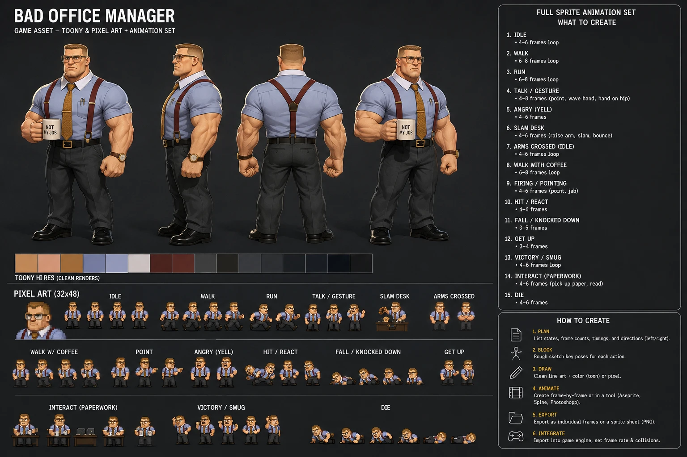

# Concept art

Style reference only. Nothing here is a spec, and nothing here ships — `docs/`
is not copied into the deploy bundle by `scripts/build-site.sh`.

## bad-office-manager-concept-sheet.webp

Character sheet for the manager: four turnaround views, a colour strip, and a
pixel-art block covering all 15 animations.

**Provenance:** AI-generated from the repo owner's sketch and prompt. It is
concept art — it was never the source the shipped frames were traced from.
`assets/sprites/bad_office_manager/gen_sprites.py` draws every frame from a pose
table, so the art in the repo comes from that generator, not from this image.

**Use it for** silhouette, build, and wardrobe: the crew cut, glasses, blue
short-sleeve shirt, maroon suspenders, gold tie, dark slacks, black shoes, wrist
watch, and the "NOT MY JOB" mug.

**Do not use it for** frame geometry or palette. Where the sheet and the repo
disagree, the repo wins:

| | this sheet | shipped pack |
|---|---|---|
| cell size | 32x48 | **48x48** |
| origin | not marked | **x: 24, y: 45** (feet on the floor) |
| palette | loose swatch strip | `bad_office_manager.gpl` |

The authoritative pack format is `assets/sprites/README.md`; the per-animation
frame counts and timings are in `assets/sprites/bad_office_manager/README.md`.

The sheet's frame counts are given as ranges, and every shipped animation lands
inside its range — so on frame counts the two agree; it is the cell size that
does not.

Its 15 animations map 1:1 onto the shipped folders, in order — idle, walk,
run, talk/gesture, angry (yell), slam desk, arms crossed, walk with coffee,
firing/pointing, hit/react, fall, get up, victory/smug, interact (paperwork),
die — so it reads as a companion to `01_idle` … `15_die`.

The sheet's "WHAT TO CREATE" and "HOW TO CREATE" panels are generic advice that
came with the generated image. They are not this project's instructions — for
briefing an artist, use `docs/hiring-a-pixel-artist.md`.
